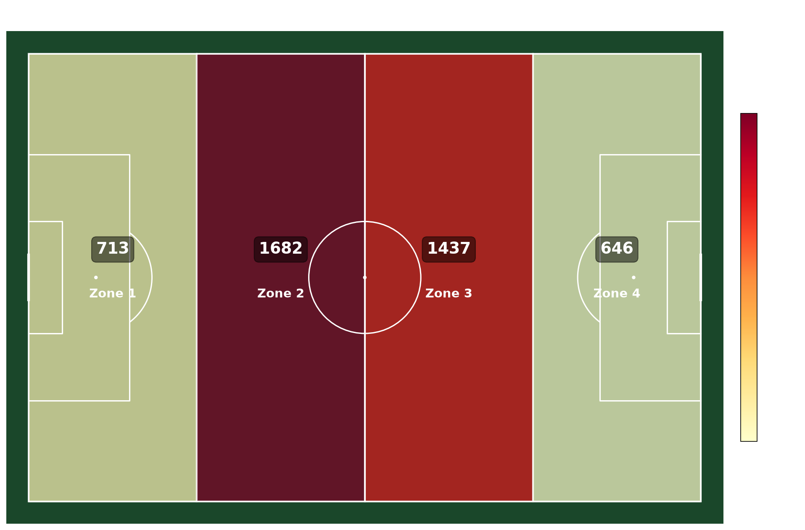

# 🏟️ Sports Zone Analytics

**Futbol sahası zone-bazlı mekânsal analiz sistemi** — StatsBomb açık verisi kullanılarak takımların saha üzerindeki performans dağılımını analiz eder.

> 🎯 GenAI Ops / MLOps öğrenme projesi: End-to-end ML pipeline kurgusu, veri mühendisliği, model eğitimi ve görselleştirme.



## 📐 Proje Yapısı

```
sports-zone-analytics/
├── src/
│   ├── data_ingestion.py        # StatsBomb API'den veri çekme
│   ├── preprocessing.py         # Zone mapping (4x1, 4x2, 3x2 grid)
│   ├── feature_engineering.py   # Zone bazlı metrikler
│   ├── visualization.py         # Heatmap, scatter, PDF rapor
│   └── generate_visuals.py      # Ana görselleştirme pipeline
├── data/
│   ├── raw/                     # Ham StatsBomb verisi
│   ├── processed/               # Zone-mapped veri
│   └── features/                # Feature engineering çıktıları
├── outputs/
│   ├── figures/                 # PNG/JPEG görseller
│   └── reports/                 # PDF raporlar
├── notebooks/                   # Jupyter notebook'lar
└── requirements.txt
```

## 🚀 Kurulum & Çalıştırma

```bash
# 1. Bağımlılıkları kur
pip install -r requirements.txt

# 2. Veriyi çek (StatsBomb FIFA World Cup 2022)
python src/data_ingestion.py

# 3. Zone mapping uygula
python src/preprocessing.py

# 4. Feature engineering
python src/feature_engineering.py

# 5. Görselleri üret
python src/generate_visuals.py
```

## 📊 Çıktı Örnekleri

### Zone Heatmap
Sahayı 4 zone'a bölerek her zone'daki olay yoğunluğunu görselleştirir.

### Takım Karşılaştırması
İki takımın zone kullanım yüzdelerini yan yana karşılaştırır.

### Pas & Şut Dağılımı
Saha üzerinde scatter plot ile başarılı/başarısız olayları gösterir.

### PDF Rapor
Tek dosyada tüm görselleri ve istatistikleri içeren takım raporu.

## 🔧 Tech Stack

| Katman | Teknoloji |
|--------|-----------|
| Veri Çekme | `statsbombpy` |
| Veri İşleme | `pandas`, `numpy` |
| ML | `scikit-learn`, `xgboost` |
| Görselleştirme | `matplotlib`, `mplsoccer`, `seaborn` |
| MLOps | `MLflow` |

## 📈 Yol Haritası

- [x] Faz 1: Veri katmanı (StatsBomb API)
- [x] Faz 2: Zone mapping (grid bazlı)
- [x] Faz 3: Feature engineering
- [x] Faz 4a: Tanımlayıcı analiz (heatmap, scatter)
- [x] Faz 5: Görselleştirme & PDF rapor
- [ ] Faz 4b: Clustering (K-Means)
- [ ] Faz 4c: Predictive model
- [ ] Faz 6: MLOps (MLflow)

## 📄 Veri Kaynağı

[StatsBomb Open Data](https://github.com/statsbomb/open-data) — FIFA World Cup 2022 event-level verisi.

## 📝 Lisans

Bu proje eğitim amaçlıdır. StatsBomb verisi kendi lisansı altındadır.
